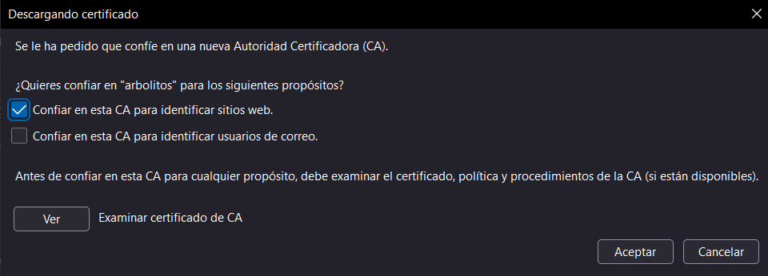

# Manual de Instalación

### Instalacion del proyecto:
Mediante la liga https://github.com/Alank99/hackerlocos/tree/main acceder al repositorio.

Una vez dentro hacer clic en el botón "<> Code":  

Se desplegaran diferentes opciones. Seleccione la opcion "download ZIP"

 

Una vez descargado se debe de descomprimir el zip dando clic derecho en el y seleccionando la opción "Extraer todo...". 

Una vez descomprimido continuar con la creacion del servidor de MongoDB

### Creación del servidor de MongoDB
    Iniciar una conexión a mongodb://localhost:27017/
    Crear una base de datos llamada "PorMexico"
    Crear una collección llamada "Usuarios"}

#### Pegar la siguiente información a la nueva collección
Una vez seleccionado la colección de usuarios, darle click en la parte de "ADD DATA" y luego en "insert document" copiar y pegar lo siguiente

    ,
    "usuario": "root",
    "password": "$2b$10$Wm1gWY2Sgs0SGXAd2m.f7up8r/6cFQ0DSDQ0PcplzhhKKp6rl5TJm",
    "fullName": "root",
    "nivel": "ejecutivo",
    "region": "cdmx",
    "id": 1

    
pegarlo en la parte de abajo del los segundos corchetes de _id
    

  *La contraseña del usuario es:* root

### Instalación 

    cd backend
    npm install package.json
    cd ..
    cd frontend
    npm install package.json
    cd ..

### Ejecución

    cd backend
    npm start
    cd ..
    cd frontend
    npm start
    cd ..

Una vez que tanto el servidor del backend como el de frontend están corriendo la página se puede abrir utilizando la siguiente liga:

http://localhost:3000/#/login

### Uso de certificados para https

Para el funcionamiento del protocolo https de nuestro proyecto se necesita verificar los certificados incluidos en este 
repositorio, para ello necesitamos aprobarlos para el uso dentro de nuestro navegador web.

1. Ir a Ajustes del navegador

2. Ir a Privacidad y seguridad -> Seguridad -> Certificados

3. Ir a Ver certificados

4. Importar un nuevo certificado

5. Agregar el certificado dentro del repositorio del proyecto

6. Confiar en esta CA para identificar sitios web

7. Ir a la direccion del backend https://localhost:1337/login y aceptar y continuar

8. Puedes utilizar la pagina web